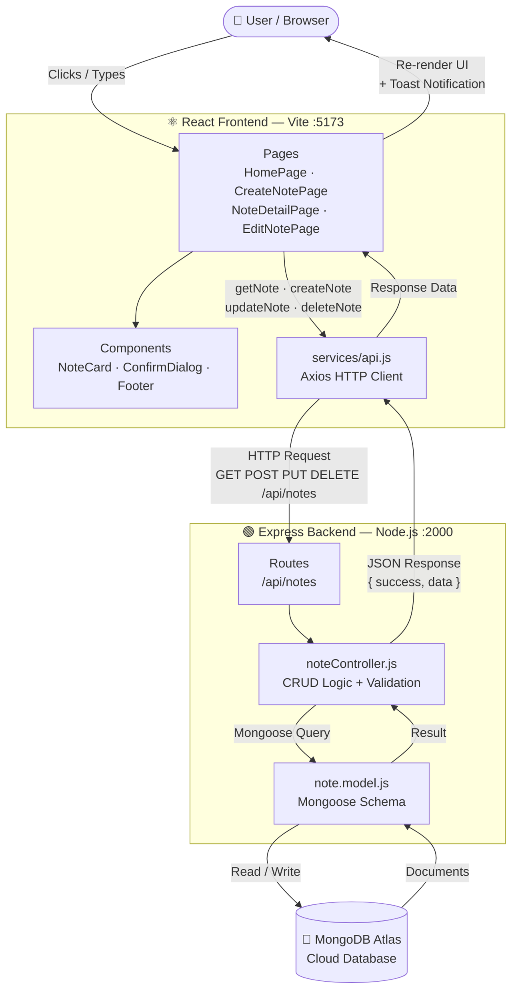
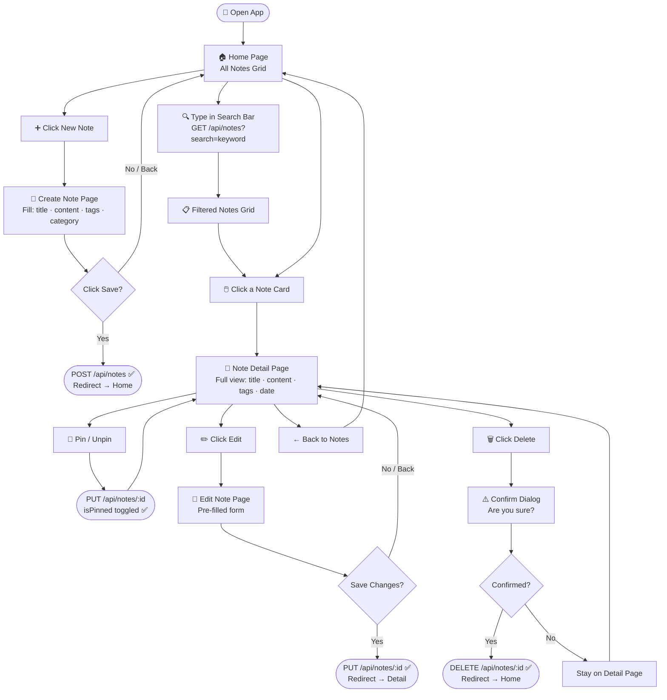
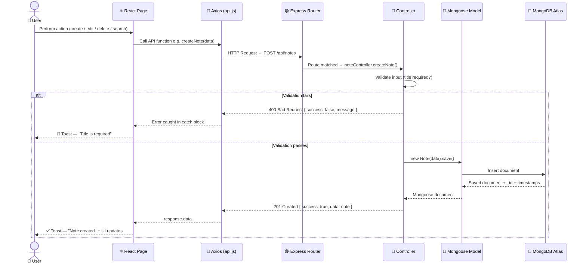

<div align="center">

# 📒 Notes Manager

### A full-stack MERN Notes Management System with a sleek dark glassmorphism UI

[](https://mongodb.com)
[](https://expressjs.com)
[](https://react.dev)
[](https://nodejs.org)
[](https://tailwindcss.com)
[](https://vitejs.dev)

[](https://render.com)
[](LICENSE)

### 🌐 [Live Demo → note-management-avse.onrender.com](https://note-management-avse.onrender.com/)

</div>

---

## ✨ Features

| Feature | Description |
|---|---|
| 📝 **Create Notes** | Add notes with title, content, tags, and category |
| 📌 **Pin Notes** | Pin important notes to keep them at the top |
| 🔍 **Search Notes** | Real-time full-text search across title and content |
| 🏷️ **Tags** | Comma-separated tags for easy organization |
| 🗂️ **Categories** | 8 preset categories — Personal, Work, Study, Ideas, and more |
| ✏️ **Edit Notes** | Update any field on an existing note |
| 🗑️ **Delete Notes** | Safe delete with a confirmation dialog |
| 🎨 **Glassmorphism UI** | Dark purple theme with frosted glass cards |
| 📱 **Responsive** | Works on desktop, tablet, and mobile |
| 🔔 **Toast Notifications** | Instant feedback on every action |
| 📅 **Auto Date** | Footer shows live auto-updating current date |

---

## 🗺️ Flow Diagrams

### 1️⃣ System Architecture — How the App Works



---

### 2️⃣ User Flow — Every Page & Action



---

### 3️⃣ API Request Lifecycle — Request to Response



---

## 🛠️ Tech Stack

### Frontend
| Package | Version | Purpose |
|---|---|---|
| React | ^18 | UI library |
| React Router DOM | ^7 | Client-side routing |
| Tailwind CSS | ^4 | Utility-first styling |
| Vite | ^8 | Build tool & dev server |
| Axios | ^1 | HTTP requests |
| react-hot-toast | ^2 | Toast notifications |
| Google Fonts — Poppins | 300–700 | Typography |

### Backend
| Package | Version | Purpose |
|---|---|---|
| Node.js | ≥18 | Runtime |
| Express | ^4 | REST API server |
| Mongoose | ^8 | MongoDB ODM |
| dotenv | ^16 | Environment variables |
| cors | ^2 | Cross-origin requests |
| nodemon | ^3 | Dev hot-reload |

---

## 📁 Project Structure

```
Notes-Management/
│
├── backend/                        # Express REST API
│   │
│   ├── models/                     # Mongoose schemas (Database layer)
│   │   └── note.model.js           # Note schema — title, content, tags, category, isPinned
│   │
│   ├── routes/                     # API route definitions
│   │   └── notes.route.js          # Maps URL paths to controller functions
│   │
│   ├── controllers/                # Business logic (CRUD operations)
│   │   └── noteController.js       # Create · Read · Update · Delete · Search
│   │
│   └── server.js                   # App entry point — Express setup + DB connection
│
├── frontend/                       # React + Vite frontend
│   │
│   ├── index.html                  # Root HTML — Google Fonts (Poppins) link
│   │
│   └── src/
│       │
│       ├── pages/                  # Full page components (one per route)
│       │   ├── HomePage.jsx        # "/"             — search bar + notes grid
│       │   ├── CreateNotePage.jsx  # "/notes/new"    — create note form
│       │   ├── NoteDetailPage.jsx  # "/notes/:id"    — full note detail view
│       │   └── EditNotePage.jsx    # "/notes/:id/edit" — pre-filled edit form
│       │
│       ├── components/             # Reusable UI components
│       │   ├── NoteCard.jsx        # Single note card shown in the grid
│       │   ├── ConfirmDialog.jsx   # Delete confirmation modal
│       │   └── Footer.jsx          # Footer with auto-updating live date
│       │
│       ├── services/               # All Axios API call functions
│       │   └── api.js              # getNotes · getNote · createNote · updateNote · deleteNote
│       │
│       ├── App.jsx                 # Router setup · header · layout wrapper
│       ├── main.jsx                # React DOM entry point
│       └── index.css               # Tailwind import · Poppins font · custom scrollbar
│
├── package.json                    # Root scripts — build & start (used by Render)
├── .env                            # MONGO_URI · PORT  (not committed to git)
└── README.md
```

# 📸 Screenshots

| Home Page | 


|Create Note |


|Single Note |


---

## 🚀 Getting Started — Local Development

### Prerequisites
- [Node.js](https://nodejs.org) ≥ 18
- [MongoDB](https://mongodb.com) (local or [Atlas](https://cloud.mongodb.com) cloud cluster)

### 1. Clone the repository

```bash
git clone https://github.com/Abhay-Pratap200001/Note-Management.git
cd Note-Management
```

### 2. Install dependencies

```bash
# Install backend dependencies
npm install

# Install frontend dependencies
npm install --prefix frontend
```

### 3. Configure environment variables

Create a `.env` file in the **root** of the project:

```env
MONGO_URI=mongodb+srv://<username>:<password>@cluster.mongodb.net/notes-db
PORT=2000
```

### 4. Run the development servers

**Option A — PowerShell script (Windows)**
```powershell
.\start.ps1
```

**Option B — Two separate terminals**
```bash
# Terminal 1 — Backend (runs on http://localhost:2000)
npm run dev

# Terminal 2 — Frontend (runs on http://localhost:5173)
cd frontend
npm run dev
```

Then open **http://localhost:5173** in your browser.

> The Vite dev server proxies all `/api` requests to `http://localhost:2000`, so no CORS issues in development.

---

## 🔌 API Endpoints

Base URL (production): `https://<your-render-app>.onrender.com`

| Method | Endpoint | Description |
|---|---|---|
| `GET` | `/api/health` | Health check — returns server status |
| `GET` | `/api/notes` | Get all notes (supports `?search=keyword`) |
| `POST` | `/api/notes` | Create a new note |
| `GET` | `/api/notes/:id` | Get a single note by ID |
| `PUT` | `/api/notes/:id` | Update a note (partial update supported) |
| `DELETE` | `/api/notes/:id` | Delete a note |

### Example Request — Create Note

```json
POST /api/notes
Content-Type: application/json

{
  "title": "My First Note",
  "content": "This is the note body...",
  "tags": ["react", "mern"],
  "category": "Study",
  "isPinned": false
}
```

### Example Response

```json
{
  "success": true,
  "data": {
    "_id": "664f2a...",
    "title": "My First Note",
    "content": "This is the note body...",
    "tags": ["react", "mern"],
    "category": "Study",
    "isPinned": false,
    "createdAt": "2026-05-10T10:00:00.000Z",
    "updatedAt": "2026-05-10T10:00:00.000Z"
  }
}
```

---

## 🗄️ Data Model

```js
// backend/models/note.model.js
{
  title:     { type: String, required: true, maxlength: 200, trim: true },
  content:   { type: String, trim: true, default: '' },
  tags:      { type: [String], default: [] },
  category:  { type: String, trim: true, default: '' },
  isPinned:  { type: Boolean, default: false },
  createdAt: Date,   // auto — mongoose timestamps
  updatedAt: Date    // auto — mongoose timestamps
}
```

Text index on `title` + `content` enables full-text search via `?search=`.

---

## ☁️ Deployment — Render

This project is configured for one-service deployment on [Render](https://render.com) — the Express backend serves the built React frontend as static files.

### Render Settings

| Setting | Value |
|---|---|
| **Environment** | Node |
| **Build Command** | `npm run build` |
| **Start Command** | `npm start` |
| **Root Directory** | *(leave blank — repo root)* |

### Root `package.json` scripts

```json
{
  "build": "npm install && npm install --prefix frontend && npm run build --prefix frontend",
  "start": "node backend/server.js"
}
```

### Environment Variables (set in Render dashboard)

```
MONGO_URI = mongodb+srv://...
PORT      = 2000
NODE_ENV  = production
```

---

## 🎨 UI Pages

| Route | Page | Description |
|---|---|---|
| `/` | Home | Search bar + responsive note grid with pin/delete actions |
| `/notes/new` | Create Note | Form with title, content, tags, category dropdown |
| `/notes/:id` | Note Detail | Full note view with pin toggle, edit, and delete |
| `/notes/:id/edit` | Edit Note | Pre-filled form for updating an existing note |

---

## 📦 Available Scripts

### Root (Backend)
```bash
npm run dev     # Start backend with nodemon (hot-reload)
npm start       # Start backend with node (production)
npm run build   # Install all deps + build frontend (used by Render)
```

### Frontend (`cd frontend`)
```bash
npm run dev     # Start Vite dev server on :5173
npm run build   # Build for production → frontend/dist/
npm run preview # Preview the production build locally
```

---

## 🤝 Contributing

1. Fork the repository
2. Create your feature branch: `git checkout -b feature/amazing-feature`
3. Commit your changes: `git commit -m 'Add amazing feature'`
4. Push to the branch: `git push origin feature/amazing-feature`
5. Open a Pull Request

---

## 📄 License

This project is licensed under the **MIT License** — feel free to use it for personal or commercial projects.

---

<div align="center">

Made with 💜 by **Abhay Pratap**

[](https://github.com/Abhay-Pratap200001)

</div>

